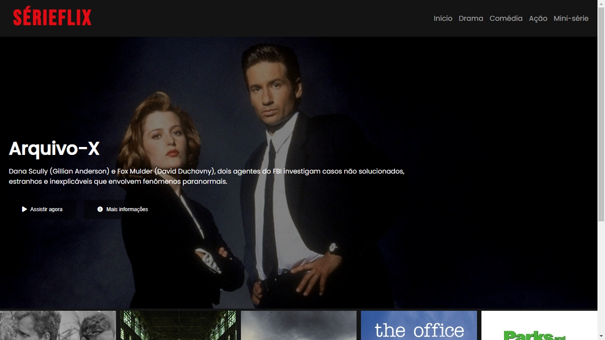
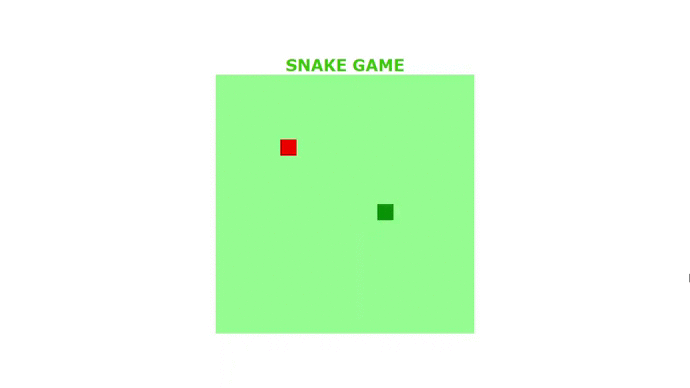

<h1 align="center">:books: Projetos dos bootcamps da Digital Innovation One :books:</h1>

<p align="center">

</p>

<p align="center">Olá! Seja bem-vindo ao meu repositório de projetos realizados durante meu aprendizado nos bootcamps da Digital Innovation One.</p>

<p align="center"><a href="https://digitalinnovation.one">Link do site</a></p>

<h2 align="center"> :computer: Tecnologias Utilizadas :computer:</h2>

<p align="center">
  
  
  
</p>

<h2 align="center">:rocket: Projetos Desenvolvidos :rocket:</h2>

<details>
  <summary>Recriando a interface do Instagram</summary>
  <p>Um desafio do bootcamp HTML Developer no qual foi proposto recriar a página inicial do Instagram.</p>
  <p align="center"></p>
  <p align="center"><a href="https://github.com/matheusz98/projetos-dio/tree/master/Projeto%20Interface%20do%20Instagram">Link do projeto</a></p>
</details>

<details>
  <summary>Recriando a interface do Netflix</summary>
  <p>Um desafio do bootcamp HTML Developer no qual foi proposto recriar a interface do Netflix.</p>
  <p align="center"></p>
  <p align="center"><a href="https://github.com/matheusz98/projetos-dio/tree/master/Projeto%20Interface%20do%20Netflix">Link do projeto</a></p>
</details>

<details>
  <summary>Recriando o jogo da cobrinha</summary>
  <p>Um desafio do bootcamp HTML Developer no qual foi proposto recriar o jogo da cobrinha em JavaScript</p>
  <p align="center"></p>
  <p align="center"><a href="https://github.com/matheusz98/projetos-dio/tree/master/Projeto%20Jogo%20da%20Cobrinha">Link do projeto</a></p>
</details>

<h2 align="center">Curtiu o repositório? Fique a vontade para fazer uso dele! :grin:</h2>

```bash
# Clonar o repositório
$ git clone https://github.com/matheusz98/projetos-dio

# Ou
# Ir no code (botãozinho verde) e fazer download do zip.
```

<h2 align="center">Muito obrigado pela visita! :smile: :grinning: </h2>
